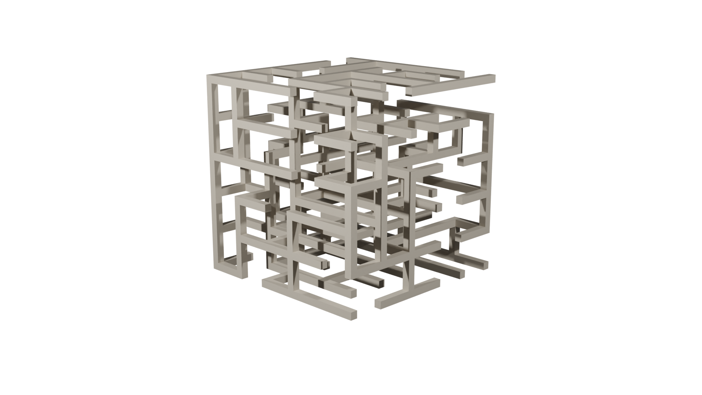
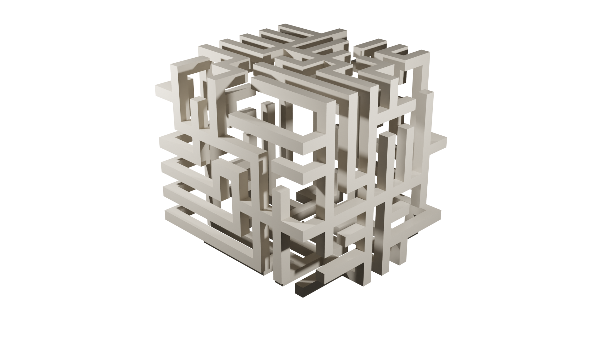
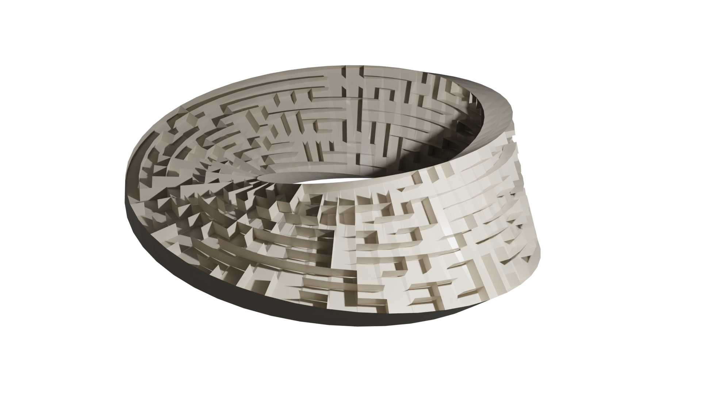

# 3d Mazes

Generate 3d maze meshes with Python in Blender.

## Maze Types

Cube mazes:


Mobius strip mazes:


Outer cube mazes (mazes along the outside faces of a cube):



## Setup

1. See my [Blender Python Setup](https://vishusandy.github.io/blender-python-setup/) article for importing modules from the current `.blend` file's path.
2. Download the files and place them in a directory.
3. Open Blender and save a new file in the same directory as `mazes.py`

## Usage

In the Python console type:

```python
from mazes import *
```

You can now use any the following functions to generate mazes:

```python
new_cube()
new_outer_cube()
new_mobius()
```


